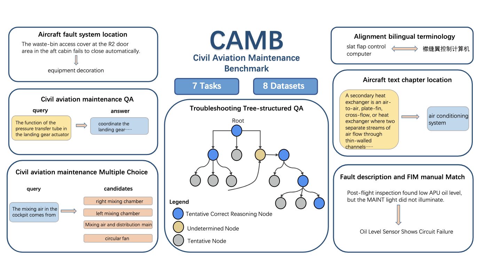
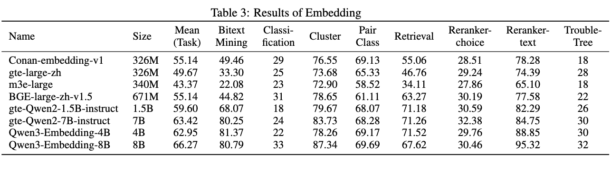
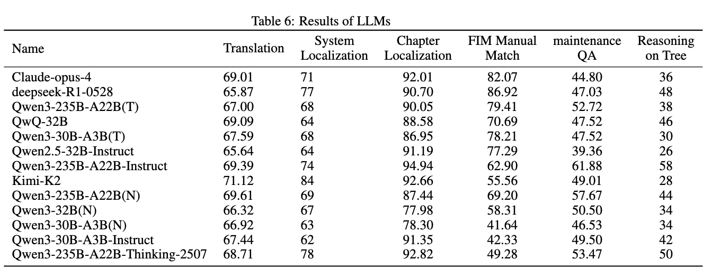
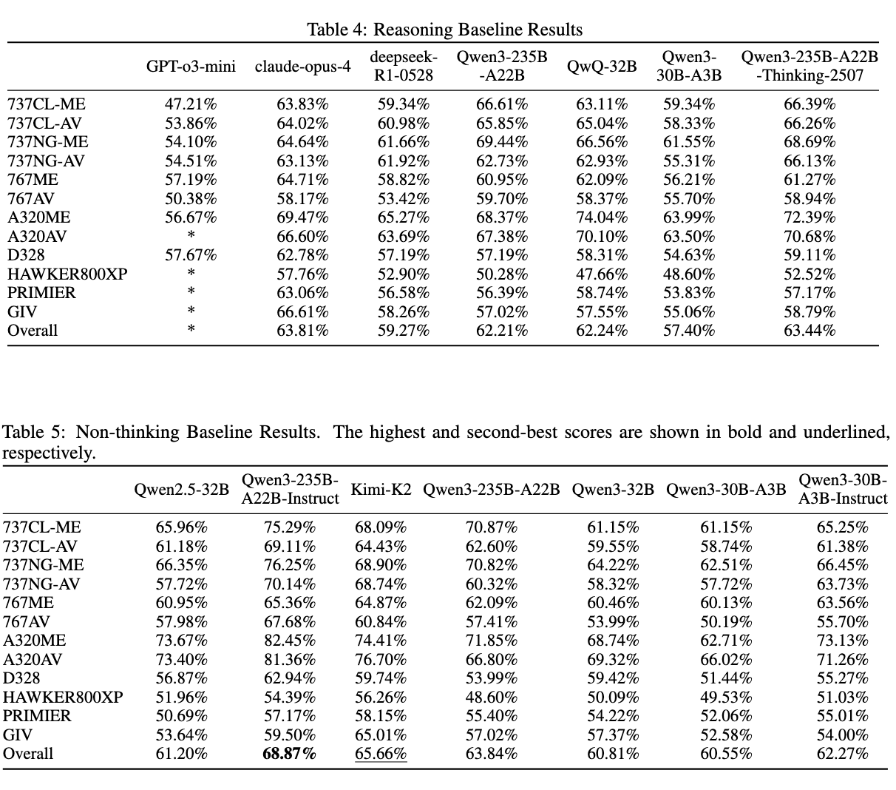

# CAMB---民用航空维修评估

<h4 align="center">
    <p>
        <b>简体中文</b> |
        <a href="https://github.com/CamBenchmark/cambenchmark/blob/master/README_EN.md">English</a> 
    <p>
</h4>

<p align="center" style="display: flex; flex-direction: row; justify-content: center; align-items: center">
📄 <a href="" target="_blank" style="margin-right: 15px; margin-left: 10px">论文</a> • 
🏆 <a href="" target="_blank"  style="margin-left: 10px">评测结果</a> •
🤗 <a href="" target="_blank" style="margin-left: 10px">数据集</a> 
</p>


## 简介

民航维修领域，行业标准严苛，知识密集，典型的富含知识和推理的业务场景。我们结合民航维修领域的业务和对大模型的理解，建设并开源了一套民航维修领域工业级的大模型评测基准(Civil Aviation Maintenance Benchmark)，也在一定程度上弥补了目前大多仅在数学和代码领域研究大模型推理的评测短板。

基于检索增强生成系统(RAG)，利用此基准评测了常用的向量嵌入模型(Embedding)和大语言模型(LLM)，并进行了一定的实验探索和分析。


<p align="center">        </p>


## 评测结果

> **Note：**
> pass

以下表格分别显示了目前 Embedding 和 LLM 在民航维修领域中的性能表现。

<details>
<summary>Embedding</summary>
<p align="center">        </p>
</details>

<details>
<summary>LLM</summary>
<p align="center">        </p>
<p align="center">        </p>

</details>


## 数据
开发和测试数据集。您也可以通过[Hugging Face]()获取我们的数据。

#### 快速使用

pass

#### 数据格式
pass。示例：

```

```

#### 提示
pass

以下是添加直接回答提示后的数据示例：

```
 
```

对于思路链提示，我们将提示从“请直接给出正确答案的选项”修改为“逐步分析并选出正确答案”。

#### 评估
pass

## 贡献
pass

## 引用

```

```
## 许可证

CAMB数据集采用
[Creative Commons Attribution-NonCommercial-ShareAlike 4.0 International License](http://creativecommons.org/licenses/by-nc-sa/4.0/).
